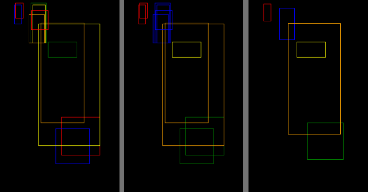

# Bounding Box Aggregation

This is a quick implementation of an idea of how, given a set of bounding boxes that do not necessarily refer to different objects, to group them and then aggregate them.

The archetypal use case for such an algorithm occurs in annotating certain images, where the goal is to locate objects. Different annotators will typically localize objects better or worse, depending on the task difficulty and personal abilities. The idea now is to use several such annotations to infer the positions of actual objects from the _wisdom of the crowd_.

## Algorithm

The algorithm is simple and based on clustering the vertices of the boxes.

```
assignment_ul <- clustering of the upper left corner points
assignment_lr <- clustering of the lower right corner points

# Find equivalence classes

partition <- {}
for each box r in {1, ..., R-1}:
    if r is already in some equivalence class:
        skip
    else:
        new_class <- {r}
        for each box s in {r+1, ..., R}:
            if r ~ s:
                new_class <- new_class ∪ {r}
        partition <- partition ∪ {new_class}
```

where `~` refers to the equivalence relation
```

r ~ s iff
        assignment_ul[r] = assignment_ul[s] 
    and assignment_lr[r] = assignment_lr[s]

```

From the groups we can infer the aggregated boxes using some statistics like mean or median over the box corners.

Since it is not clear from the outset how many clusters must be selected, this number must first be found out. In general, we choose the partition for which the mean IoU is maximal. The mean IoU is calculated in such a way that we first calculate the pairwise IoU of all boxes within each group and then average over these values. Then these averaged values can be averaged again or aggregated in some other way. Note, however, that the "standard IoU" does not work as a metric here, since otherwise groups with one bounding box each would always be favored. Instead, we compute an average IoU that takes into account the number of elements per group.


## Results

For a set of synthetic bounding boxes, the results of running the algorithm are shown.

From the unordered set of bounding boxes (left), a clustering (center) is first generated. Within each group, an aggregated box can then be calculated (right).


